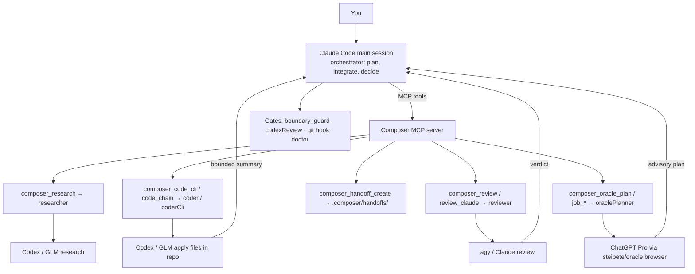

# Composer — multi-agent orchestration for daily coding

[](#install) [](#architecture) [](#license)

> **Claude Code stays the main brain. Composer routes planning, coding, research, review, and safety gates to the right worker model.**

Composer is an MCP server plus Claude Code plugin for people who want the strongest model to hold the product and architecture context, while cheaper or more specialized models do the mechanical work. It keeps the main Claude session focused on intent, integration, and decisions instead of spending tokens on raw code generation, patch application, repeated research, or long review logs.

## Why this exists

Modern LLM development gets expensive and messy when one chat session does everything:

- planning the feature,
- searching docs,
- editing files,
- debugging failures,
- reviewing the diff,
- remembering local workflow rules,
- and enforcing commit gates.

Composer separates those jobs.

| Need                                  | Composer answer                                                                                                                 |
| ------------------------------------- | ------------------------------------------------------------------------------------------------------------------------------- |
| Keep the best model as the strategist | Claude Code orchestrates; optional ChatGPT Pro via Oracle acts as a slow co-oracle for hard planning/review/debugging.          |
| Save Claude Code tokens               | Codex, GLM, `agy`, and bounded `claude -p` calls run outside the main Claude context and return compact summaries.              |
| Let workers edit locally              | `composer_code_cli` lets Codex or another CLI executor generate **and apply** code directly in the repo.                        |
| Avoid copy/paste between agents       | `composer_handoff_create` writes shared packets under `.composer/handoffs/`.                                                    |
| Add quality gates                     | Review lanes, Codex pre-commit review, Claude Code hooks, terminal git hooks, and doctor checks make failures visible.          |
| Improve over time                     | The `composer-mastermind` skill and `/evolve` loop let routing guidance improve from real failures, with manual promotion only. |

## Real-world scenarios

### 1. Build a feature without burning the main context

```text
You describe the feature
→ Claude Code creates a compact handoff
→ Codex implements with composer_code_cli
→ agy reviews with composer_review
→ Claude Code integrates only the summary and decisions
```

### 2. Use ChatGPT Pro only when it is worth the wait

```text
Architecture unclear?       → composer_oracle_plan(mode="deep")
Hard root cause?            → composer_oracle_plan(mode="debug")
Large risky diff?           → composer_oracle_plan(mode="review")
Long research, not urgent?  → composer_oracle_job_start + composer_oracle_job_result
Routine docs lookup?        → composer_research, not Oracle
```

Oracle is deliberately opt-in. It drives a real ChatGPT Pro browser session through `steipete/oracle`, so it is slower and should be used for high-value reasoning, not every small question.

### 3. Keep commits gated

```text
Claude-issued git commit      → PreToolUse pre-commit gate can deny
Manual terminal git commit    → install the real .git/hooks/pre-commit bridge
CI / protected branch         → recommended final backstop
```

### 4. Recover when a bug fight stalls

```text
1 failed fix          → inspect locally and retry normally
2+ failed attempts    → Codex lifecycle/rescue or Oracle debug
Patch produced        → composer_review before reporting done
```

## Quick start

### Install

```bash
npm install -g agent-composer
```

### Recommended global setup

Use this when you want Composer available from many projects.

```bash
agent-composer init --global
$EDITOR ~/.config/composer/.env.json
agent-composer doctor
```

Then launch Claude Code from any repo:

```bash
claude
```

### Project-local setup

Use this when a repo needs its own provider routing or stricter gates.

```bash
cd your-project
agent-composer init
$EDITOR .env.json
agent-composer doctor
```

### Optional ChatGPT Pro / Oracle setup

Oracle is not enabled by default.

```bash
cd your-project
agent-composer init --oracle
scripts/oracle-pro-safe.sh --mode quick -- "Say OK."
agent-composer doctor
```

The first real Oracle run may open a browser for login. Complete the ChatGPT login once, then rerun the smoke test. The adapter probes optional Oracle browser flags before using them, so it should degrade gracefully across compatible Oracle builds.

## Cheat sheet

### User prompts

| What you want                      | Say this                                                     |
| ---------------------------------- | ------------------------------------------------------------ |
| Normal code change                 | “Implement this using Composer.”                             |
| Multi-file feature                 | “Create a handoff, implement via Codex, then review.”        |
| Current docs or API lookup         | “Use `composer_research` first.”                             |
| Hard architecture planning         | “Use `composer_oracle_plan` with mode `deep`.”               |
| Risky diff review                  | “Run `composer_review`, then Oracle review if risk remains.” |
| Stuck debugging                    | “Use Oracle debug after the failed attempts.”                |
| Do not block while Oracle thinks   | “Start an async Oracle job and poll it later.”               |
| Premium Claude review              | “Escalate to `composer_review_claude`.”                      |
| Disable Composer hooks temporarily | `COMPOSER_ENABLED=0 claude` or `touch .composer-disabled`    |

### MCP tools

| Tool                              | Use it for                                                                |
| --------------------------------- | ------------------------------------------------------------------------- |
| `composer_handoff_create`         | Create a compact shared packet for multi-agent work.                      |
| `composer_research`               | Fast docs/current-context lookup through the researcher role.             |
| `composer_code_cli`               | Default code-edit lane. Codex/CLI executor writes files directly.         |
| `composer_code_chain`             | GLM writes complete file blocks; Composer applies them deterministically. |
| `composer_code`                   | Legacy patch/text-only GLM lane. Rare fallback.                           |
| `composer_review`                 | Default diff review lane.                                                 |
| `composer_review_claude`          | Expensive second-opinion review.                                          |
| `composer_oracle_plan`            | Synchronous ChatGPT Pro planning/review/debug lane.                       |
| `composer_oracle_job_start`       | Non-blocking Oracle job for long work.                                    |
| `composer_oracle_job_result`      | Poll/read an Oracle job result.                                           |
| `composer_codex_lifecycle_decide` | Cheap policy decision: skip, ask, or run Codex.                           |
| `composer_codex_lifecycle_run`    | Run an advisory Codex lifecycle checkpoint.                               |
| `composer_codex_lifecycle_result` | Read a lifecycle checkpoint result.                                       |
| `composer_route_decide`           | Choose the next Composer lane for a task.                                 |
| `composer_workflow_plan`          | Produce an ordered workflow plan for multi-step work.                     |
| `composer_audit_record`           | Append a structured audit event.                                          |
| `composer_audit_read`             | Read recent audit events for project context.                             |
| `composer_audit_summary`          | Summarize recent routing, review, test, and outcome audit events.         |
| `composer_session_get`            | Inspect the current Composer session settings.                            |
| `composer_session_set`            | Update session-local mode, oracle, or profile settings.                   |
| `composer_status`                 | Read config, integration, activity, and recommendation status.            |
| `composer_goal_start`             | Start one project goal with objective, condition, checks, and budget.     |
| `composer_goal_status`            | Inspect active or named goal state and next advisory action.              |
| `composer_goal_step`              | Advance the advisory goal loop from deterministic check results.          |
| `composer_goal_clear`             | Cancel or clear a project goal record.                                    |
| `composer_config_get`             | Inspect active/project/global Composer config.                            |
| `composer_config_set`             | Safely patch lifecycle and review-gate settings.                          |

### Oracle force tags

Use these when you want deterministic routing inside an Oracle prompt or wrapper:

```text
[oracle:quick]      Small sanity check through ChatGPT web.
[oracle:standard]   Moderate design question.
[oracle:deep]       Feature planning, architecture, migration design.
[oracle:plan]       Same as deep, but semantically a plan.
[oracle:review]     High-risk design or diff review.
[oracle:debug]      Hard root-cause analysis.
[oracle:research]   Slow research/synthesis.
[oracle:async]      Orchestrator hint: use the async Oracle job tools.
[codex]             Keep it on the cheaper Codex lane.
```

## Daily workflows

### Feature work

```text
1. composer_handoff_create
2. composer_research if current docs/API context is needed
3. composer_oracle_plan(mode="deep") only if architecture is unclear
4. composer_code_cli to implement
5. composer_review on the diff
6. targeted tests / typecheck
7. optional composer_review_claude for high-risk changes
```

### Hard debugging

```text
1. Capture the smallest failing command/output.
2. Try the obvious local fix once.
3. After repeated failure, call composer_oracle_plan(mode="debug") or Codex rescue.
4. Feed the diagnosis to composer_code_cli.
5. Run tests and composer_review.
```

### Review before merge

```text
Routine diff         → composer_review
Large/risky diff     → composer_review + composer_oracle_plan(mode="review")
Security-sensitive   → composer_review + composer_review_claude, optionally Oracle review
```

### Long research

```text
Blocking decision     → composer_oracle_plan(mode="research")
Useful but not urgent → composer_oracle_job_start(mode="research"), then poll result
Routine lookup        → composer_research
```

## Architecture



### Main components

| Path                          | Purpose                                                               |
| ----------------------------- | --------------------------------------------------------------------- |
| `src/server.ts`               | Registers Composer MCP tools.                                         |
| `src/providers/`              | Provider adapters: CLI, Anthropic-compatible, mock.                   |
| `src/util/`                   | Handoffs, lifecycle jobs, Oracle jobs/locks, dispatch hints, helpers. |
| `plugin/composer-mastermind/` | Claude Code plugin: skill, subagents, hooks, `/evolve`.               |
| `scripts/`                    | Oracle adapters, review hooks, release/dev helpers.                   |
| `docs/adr/`                   | Architecture decisions and append-only contracts.                     |
| `tests/`                      | Vitest, hook tests, script tests.                                     |

### Execution model

Composer has one invariant:

> The main Claude session coordinates. Worker lanes execute. Review gates decide whether work is good enough.

That means:

- Claude Code should plan, inspect, verify, and integrate.
- File writes should go through `composer_code_cli` or `composer_code_chain`.
- Review should run through a different model/provider than the author whenever practical.
- Oracle is advisory only; it never edits files.
- Background jobs are persisted as state records, but Oracle async jobs are server-lifetime, not OS-detached workers.

## Configuration

Composer reads config from the active project first, then from the global Composer config when no project config exists.

| File                    | Purpose                                                                    |
| ----------------------- | -------------------------------------------------------------------------- |
| `composer.config.json`  | Provider roles, lifecycle policy, review-gate settings. Usually committed. |
| `.env.json`             | Provider credentials. Never commit.                                        |
| `.claude/settings.json` | Claude Code MCP server wiring and hooks.                                   |

### Minimal provider roles

```json
{
  "roles": {
    "researcher": {
      "provider": "cli",
      "cli": ["codex", "--search", "--ask-for-approval", "never", "exec", "--ephemeral", "--sandbox", "read-only"],
      "timeoutMs": 180000,
      "retries": 0
    },
    "coder": {
      "provider": "anthropic",
      "baseUrl": "https://api.z.ai/api/anthropic",
      "apiKeyEnv": "ANTHROPIC_AUTH_TOKEN"
    },
    "coderCli": {
      "provider": "cli",
      "cli": ["codex", "exec", "--ephemeral", "--sandbox", "workspace-write", "-c", "approval_policy=\"never\"", "-c", "model_reasoning_effort=\"medium\""],
      "timeoutMs": 900000,
      "retries": 0
    },
    "reviewer": {
      "provider": "cli",
      "cli": ["agy", "--dangerously-skip-permissions", "--print-timeout", "110s", "-p"],
      "timeoutMs": 120000,
      "retries": 1
    }
  }
}
```

Currently wired provider IDs are `mock`, `anthropic`, and `cli`. The schema reserves `openai_compatible`, but the runtime does not yet implement that adapter.

### Optional Oracle role

Created by `agent-composer init --oracle`:

```json
{
  "roles": {
    "oraclePlanner": {
      "provider": "cli",
      "cli": ["bash", "scripts/oracle-plan-mcp.sh", "--mode", "auto", "--"],
      "timeoutMs": 1500000,
      "retries": 0,
      "maxResultChars": 14000
    }
  }
}
```

Keep `researcher` on Codex. Oracle is for opt-in planning/review/debugging, not routine search.

### Codex lifecycle policy

`codexLifecycle` controls advisory Codex participation at lifecycle points such as post-plan, post-code, test failure, or repeated failed attempts.

```json
{
  "codexLifecycle": {
    "enabled": true,
    "mode": "ask",
    "execution": "background",
    "model": "gpt-5.4-mini",
    "triggers": {
      "postPlan": true,
      "postCodeApply": true,
      "postTestFailure": true,
      "afterFailedAttempts": true,
      "preCommit": false,
      "stopWarm": false
    },
    "thresholds": {
      "minScore": 60,
      "minExpectedOutputTokens": 500,
      "minChangedFiles": 2,
      "minDiffLines": 80,
      "failedAttempts": 2
    },
    "fallback": {
      "enabled": true,
      "order": ["reviewerClaude", "reviewer", "coder"]
    }
  }
}
```

Lifecycle runs are advisory. They should not silently mutate files; apply suggestions through the normal code lane and review them.

### Codex review gate

`codexReview` controls optional cross-LLM review and pre-commit gating.

```json
{
  "codexReview": {
    "enabled": true,
    "preCommitCommand": "adversarial-review",
    "scope": "auto",
    "model": "gpt-5.5",
    "preCommitHook": {
      "enabled": true,
      "blockOnSeverity": "high",
      "timeoutMs": 900000,
      "failClosed": true
    },
    "warmCache": {
      "enabled": true,
      "maxAgeMinutes": 30
    }
  }
}
```

To gate manual terminal commits, install the real Git hook bridge:

```bash
printf '#!/usr/bin/env bash\nexec "$(git rev-parse --show-toplevel)/scripts/precommit_codex_review.sh" --git-hook\n' \
  > .git/hooks/pre-commit
chmod +x .git/hooks/pre-commit
```

`git commit --no-verify` still bypasses local Git hooks. Use CI and branch protection when every commit path must be enforced.

### Spend and consent policy

`spendAuthorization` is a routing/consent policy exposed to the orchestrator and config tools.

```json
{
  "spendAuthorization": {
    "mode": "interactive",
    "maxUsdPerCall": 0.5,
    "maxUsdPerSession": 5.0
  }
}
```

CLI providers such as Codex and `agy` are billed by their own authentication and do not share a universal billing meter with Composer. Keep provider budgets conservative and use `agent-composer doctor` before relying on gates.

### Config tools

Inside Claude Code, prefer MCP config tools over hand-editing JSON:

```text
composer_config_get(scope="active")
composer_config_set(scope="project", codexLifecycle={...})
composer_config_set(scope="project", codexReview={...})
```

`composer_config_set` intentionally accepts narrow patches for lifecycle and review-gate settings, validates the result, and refuses implicit writes to the global fallback path.

## Trust, security, and limits

Composer is designed for supervised local development.

### What is mechanically enforced

- `boundary_guard.sh` denies main-thread file mutation tools and MCP write/edit/exec wrappers.
- `composer_code_chain` rejects path traversal and symlink escapes before applying files.
- `CLIProvider` uses argv arrays, not shell interpolation, and refuses dangerous Codex sandbox configs by default.
- Codex pre-commit gates can fail closed in Claude Code hook mode and terminal git-hook mode.
- Oracle browser runs are protected by a single-holder lock and stored under local Composer state / `.composer/oracle/` artefacts.

### What still needs project discipline

- Use branch protection / CI for `git commit --no-verify` or pushes from outside the local workflow.
- Do not pass secret files to Oracle or any external provider.
- Treat Oracle browser automation as a personal, supervised workflow, not a high-volume API.
- Review all code changes before reporting success.

### Local artefacts to keep out of Git

At minimum:

```gitignore
.env.json
.composer/handoffs/
.composer/codex-lifecycle/
.composer/oracle/
.composer/results/
.composer/briefs/
```

## Doctor and validation

Run this whenever setup feels suspicious:

```bash
agent-composer doctor
```

Add `--json` for a machine-readable report (full JSON on stdout; exit 0 = healthy, exit 1 = unhealthy):

```bash
agent-composer doctor --json
```

Useful local checks for contributors:

```bash
npm run typecheck
npm run test
npm run test:hooks
npm run test:scripts
npm run schema:lint
```

Oracle-specific smoke tests:

```bash
scripts/oracle-pro-safe.sh --dry-run --mode quick -- "Smoke test. Say OK."
scripts/oracle-pro-safe.sh --mode quick -- "Say OK and identify the mode/model."
```

## Project layout

```text
agent-composer/
├── src/
│   ├── server.ts                 # MCP tool registration
│   ├── providers/                # CLI / Anthropic-compatible / mock providers
│   ├── config/                   # config loader, paths, schema mirror
│   ├── cli/                      # init, doctor, dispatch hint helpers
│   └── util/                     # handoffs, jobs, locks, routing, apply helpers
├── plugin/composer-mastermind/   # Claude Code plugin, skill, subagents, hooks
├── scripts/                      # Oracle adapters, review gates, release helpers
├── docs/adr/                     # architecture decisions
├── tests/                        # Vitest, hook, and script tests
└── composer.config.schema.json   # user-facing config schema
```

## Development

```bash
git clone https://github.com/xicv/agent-composer.git
cd agent-composer
npm install
npm run typecheck
npm run test
npm run test:hooks
npm run test:scripts
npm run schema:lint
npm run build
```

Before publishing or merging a large routing change, run a real dogfood task through:

```text
handoff → code_cli → review → targeted tests → doctor
```

## Design principles

1. **One brain, many workers.** The orchestrator owns intent; providers own execution.
2. **Offload complete work, not fragments.** Prefer workers that apply files and return summaries.
3. **Review with a different model.** Author and reviewer should usually be different providers.
4. **Keep Oracle rare and valuable.** ChatGPT Pro is for hard reasoning, not routine lookup.
5. **Make state durable and inspectable.** Handoffs, jobs, answers, and reviews should have paths.
6. **Prefer opt-in gates.** Strong gates are available, but users choose the strictness per repo.
7. **Never hide uncertainty.** Failed providers, skipped reviews, and orphaned jobs should surface as records, not disappear.

## License

MIT.
